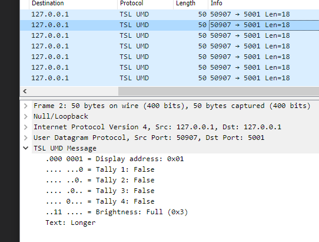

# tslumd-wireshark

Wireshark dissector for TSL UMD (under-monitor display) protocol V3.1, V4.

For details of the protocol, see https://tslproducts.com/media/1959/tsl-umd-protocol.pdf
## Installation

Copy `tsl_dissector.lua` to your Wireshark plugin directory, e.g. `C:\Program Files\Wireshark\plugins` 

Alternatively, start Wireshark withe command-line option `-X lua_script:tsl_dissector.lua`

## Usage

The dissector binds to UDP port 5001 by default. To use with other ports use Wireshark's "Decode as..." dialog.

### Features

* Decodes V3.1 and V4 packets
* Detects a few simple protocol errors 

### Known limitations

* No TCP packet reassembly
* No checksum tests or full dissection for V4 packets
* No support for V5 protocol

## Contributing
Pull requests are welcome. For major changes, please open an issue first to discuss what you would like to change.

Please make sure to update tests as appropriate.

## License
[GPL 2.0](https://choosealicense.com/licenses/gpl.2.0/)